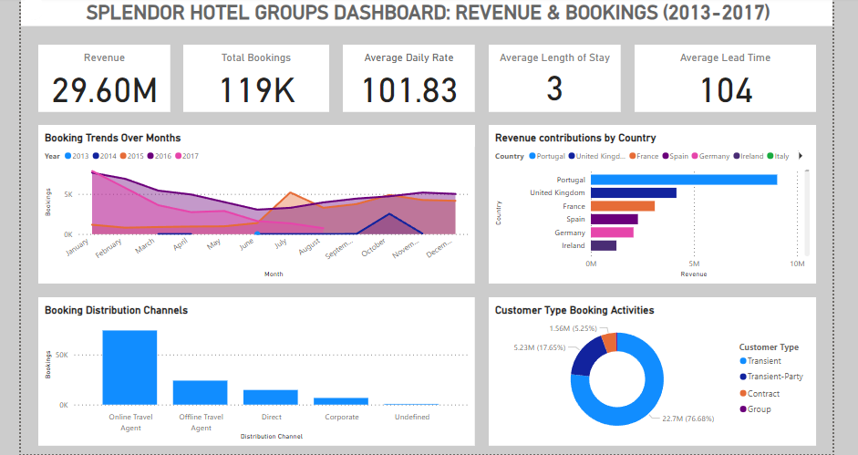

# Splendor Hotel Groups (SHG) Data Analysis Project

Hello and welcome to the Splendor Hotel Groups (SHG) Data Analysis Project repository! This project focuses on analyzing comprehensive data related to bookings, guest demographics, distribution channels, and financial metrics within the hospitality industry, specifically focusing on the operations of Splendor Hotel Groups from 2013 to 2017.

## Project Overview

The objective of this project is to extract meaningful insights from the provided dataset to inform operational improvements and contribute to the overall success of SHG in delivering unparalleled hospitality experiences.

## Data Source

The data used in this project is sourced from Twitter. You can find the original data [here](https://twitter.com/iam_Uchenna/status/1728104132219924881?t=IrzjP2ShoNe6PDO1pWrIng&s=19)

## Key Objectives of the Analysis

 ### Booking Patterns:
- Analyze trends in booking patterns over time and identify specific seasons or months with increased booking activity.
- Investigate how lead time varies across different booking channels and explore any correlation between lead time and customer type.

### Customer Behavior Analysis:
- Explore customer demographics, distribution channel contributions, and patterns in guest origin to understand their impact on revenue and operational strategies.

### Cancellation Analysis:
- Identify factors correlated with cancellations and predict potential cancellations based on certain variables.

### Revenue Optimization:
- Analyze revenue trends, optimal pricing strategies, and revenue contribution by customer type and distribution channel.

### Geographical Analysis:
- Study the distribution of guests across different countries to target marketing efforts effectively.

### Operational Efficiency:
- Analyze average length of stay, check-out date patterns, and the impact of deposit types on cancellations and revenue.

### Time-to-Event Analysis:
- Understand how lead time between booking and arrival date affects revenue and cancellations.

### Comparison of Online and Offline Travel Agents:
- Compare revenue contributions, cancellation rates, and revenue trends between online and offline channels.

## Contents of the Repository
- *README.md:* This is the introductory and explanatory document for this repository.
- *SQL Queries:* Contains SQL queries used for data extraction, transformation, and analysis.
- *Power BI Visualizations:* Includes interactive visualizations created using Power BI for data exploration and insights.
- *Documentation:* Provides comprehensive documentation detailing data sources, methodologies, actionable insights, and key findings.
- *Reports:* Includes a detailed report summarizing the analysis, insights, and recommendations derived from the data.

## How to Use
1. *Clone the Repository:* Use Git to clone this repository to your local machine.
2. *Data Analysis:* Execute the provided SQL queries to perform data analysis and extract insights.
3. *Explore Visualizations:* Download the Power BI report (.pbix file) to explore interactive visualizations and gain deeper insights.
4. *Review Documentation:* Refer to the documentation for a detailed explanation of data sources, methodologies, and actionable insights derived from the analysis
